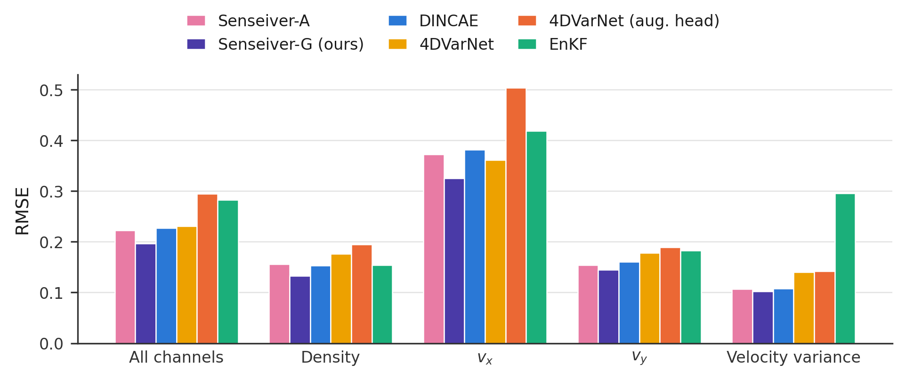
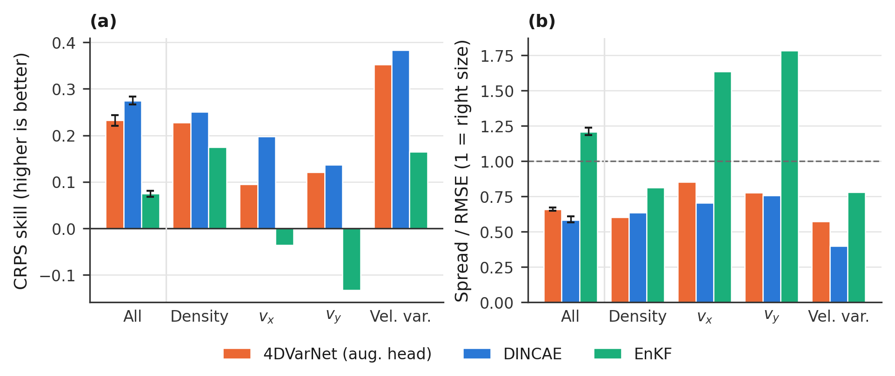
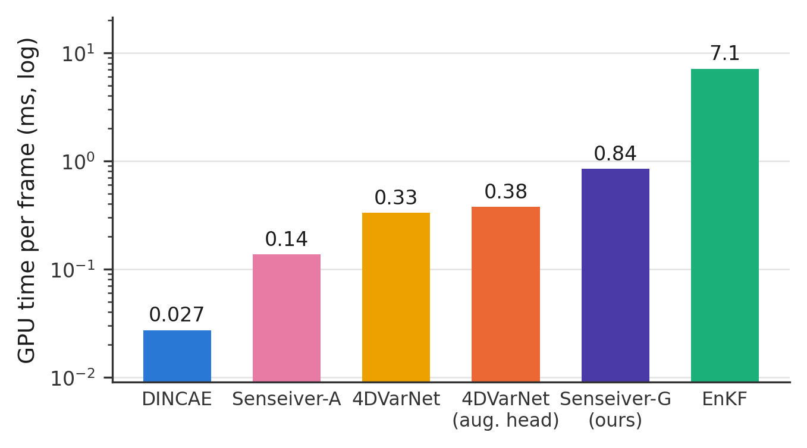

# Partial Observation Comparison — evaluation

Three robots move through a shopping-centre corridor (the ATC pedestrian
dataset, Osaka) and each senses only the cells near itself. Six methods
reconstruct the **full** crowd state — density, velocity $(v_x, v_y)$ and
velocity variance on a 36 × 12 grid, one frame per second — from those partial
observations; three of them also predict their own uncertainty.

This README covers **how the final comparison is evaluated and how the data is
split**. Background on the methods, training, and the experiment history is in
[PROJECT_OVERVIEW.md](PROJECT_OVERVIEW.md).

## Quick start

On Aalto Triton, from the repository root:

```bash
sbatch supervisor_evaluation/sbatch/smoke.sbatch   # ~2 min on gpu-debug: end-to-end check, not results
sbatch supervisor_evaluation/sbatch/full.sbatch    # complete evaluation -> supervisor_evaluation/outputs/full/
```

Everything goes through one script, `supervisor_evaluation/evaluate.py`
(`bench_inference.py` next to it is called by it, never run on its own). It
imports code from the rest of the repository (`crowdcore/`, `compare/`,
`methods/`), so it must be run inside this repository, from its root.

- **Environment:** `source sbatch/_env.sh` loads Triton's
  `scicomp-pytorch-env/2026.1` (Python 3.12) and sets `PYTHONPATH`; elsewhere,
  `pip install -r requirements.txt`. A GPU is required.
- **Weights:** the nine files in `supervisor_evaluation/models/` are the frozen
  final models and are part of the repository. `models/manifest.json` records
  their SHA-256; every run checks them first and refuses to start on a mismatch.
- **Data:** not in the repository. Point `--data-root` (or `data.root` in
  `crowdcore/config.yaml`) at a directory laid out as described
  [below](#data-layout). The two job scripts use `/scratch/work/zhangx29/data`;
  change that path to run on another copy.

What `full` does, in order: verify packages, checkpoint hashes, data schema and
test dates → score the six methods on the seven test days → run the EnKF →
score uncertainty for the three probabilistic methods on one shared protocol →
benchmark inference time on one GPU → write CSVs and figures. The command
reference (single steps, reruns, image boards) is in
[supervisor_evaluation/README.md](supervisor_evaluation/README.md).

## Dataset split

The ATC dataset records the corridor on Sundays and Wednesdays for about a
year. **Only the 46 available Sundays are used** (one weekday pattern, so crowd
behaviour is comparable between days). The split is **chronological, never
shuffled** — training is the earliest stretch, validation the middle, test the
latest — so no afternoon is seen from both sides of a boundary.

| Split | Days | Frames | Date range | Used for |
|---|---|---|---|---|
| train | 32 | 1,262,518 | 2012-10-28 → 2013-06-09 | fitting weights and all training-derived statistics |
| valid | 7 | 269,743 | 2013-06-16 → 2013-07-28 | choosing checkpoints and calibration constants |
| test | 7 | 277,543 | 2013-08-11 → 2013-09-29 | every reported number |

Test days: `20130811 20130818 20130825 20130901 20130915 20130922 20130929`.
There is no recording for the Sundays 2013-08-04 and 2013-09-08 in the source
data, which is why they are missing. Every frame of every test day is scored
(about 38,000–43,000 frames per day, ~11 hours); nothing is subsampled.

**Where the split is defined.** The code reads three list files from the data
root, `sunday_atc_{train,valid,test}.lst` (one `ATC/Sundays/atc-YYYYMMDD.h5`
per line; `crowdcore/observation_model.split_files`). Copies of the exact lists
used are in [`supervisor_evaluation/data_split/`](supervisor_evaluation/data_split/).
`evaluate.py` also pins the test dates in `TEST_DATES`; the `verify` step that
starts every run fails unless the test list and `TEST_DATES` name exactly the
same days.

**Using a different split.**

- *Different test days only:* put the new days in `sunday_atc_test.lst`, update
  `TEST_DATES` in `evaluate.py` to match, and make sure their gridded files
  exist (see below). The new test days must not appear in the train or valid
  lists. No retraining is needed.
- *Different train or valid days:* the packaged weights are no longer valid.
  Besides the model weights, these are fitted on the training days and must be
  rebuilt with the new split: the walkable-cell mask (a cell is walkable if its
  density exceeds 0.5 on some training day; cached as
  `grid_cache/visited_union_train_tau0.5_corridor.npy` — delete it and it is
  recomputed from the training list), DINCAE's normalisation statistics
  (`methods/dincae/artifacts/state_stats.npz`), and the EnKF's residual noise
  bank. Retraining is described in [PROJECT_OVERVIEW.md](PROJECT_OVERVIEW.md).

## Data layout

```
<data-root>/
  sunday_atc_train.lst  sunday_atc_valid.lst  sunday_atc_test.lst
  grid_cache/atc-YYYYMMDD_corridor_1.0s.h5        # one file per day
  grid_cache/visited_union_train_tau0.5_corridor.npy   # training-day walkable evidence
```

Each gridded day file holds `grid` — float32 `(N, 4, 36, 12)`, channels
`[density, vx, vy, vel_var]`, 1 m cells, one frame per second — and `time`
`(N,)`. They are produced from the raw ATC CSV files by
`crowdcore/data/csv_to_h5.py` and `crowdcore/data/h5_to_grid.py`; the pipeline
and its validation are documented in
[crowdcore/data/DOC_data_pipeline.md](crowdcore/data/DOC_data_pipeline.md).

## Observation protocol

Set in `crowdcore/config.yaml` (`observation:`), identical for every method:
three robots follow A* routes between random walkable goals, one cell per
second; a walkable cell is observed at a frame if it is within 7 cells of a
robot and in line of sight (obstacles from the real ATC map block sight).
On average about 56% of walkable cells are observed at a frame; the other 44%
are the blind cells the headline scores are computed on. Observations carry
per-channel Gaussian noise. Robot routes are seeded by the day's date, so every
day has its own routes and every script sees the same observations for a day.

## Results, and how to read them

All numbers are over the seven test days, on **unobserved walkable cells**:
cells inside the corridor that no robot sees at that frame (about 44% of
walkable cells). Reconstructing them is the actual task; obstacle cells are
never scored. The four quantities being reconstructed are:

| Channel | Meaning | Unit |
|---|---|---|
| Density | how many people are in the cell | ≈ people per m² |
| $v_x$, $v_y$ | mean walking velocity in the cell, along and across the corridor | m/s |
| Vel. var. | how much the velocities in the cell disagree (people walking in different directions) | (m/s)² |

### 1. Reconstruction accuracy — how close is the reconstructed field to the truth?

**RMSE** (root-mean-square error): the typical size of the difference between
the reconstructed value and the true value, in the channel's own unit. **Lower
is better.** For example, a density RMSE of 0.13 means the reconstruction is off
by about 0.13 people per m² in a typical cell. "All" pools the four channels
into one number.

| Method | All | Density | $v_x$ | $v_y$ | Vel. var. |
|---|---|---|---|---|---|
| Senseiver-A | 0.222 | 0.156 | 0.372 | 0.154 | 0.107 |
| **Senseiver-G (ours)** | **0.197** | **0.133** | **0.326** | **0.145** | **0.103** |
| DINCAE | 0.227 | 0.153 | 0.381 | 0.160 | 0.108 |
| 4DVarNet | 0.231 | 0.176 | 0.361 | 0.178 | 0.140 |
| 4DVarNet (aug. head) | 0.295 | 0.195 | 0.504 | 0.189 | 0.142 |
| EnKF | 0.283 | 0.154 | 0.419 | 0.183 | 0.295 |



*How to read the figure:* each group of bars is one channel (the left group is
all channels together); each colour is one method, the same colour in every
figure. A shorter bar is a smaller error.

*What it shows:* Senseiver-G has the smallest error overall and on every
channel. Giving 4DVarNet an uncertainty output (aug. head) costs accuracy,
mostly on $v_x$. The EnKF is competitive on density but has by far the largest
error on velocity variance.

### 2. Uncertainty — does the method know where it is likely to be wrong?

Three methods output, for every cell, not only a value but also an uncertainty
σ̂ ("I think the density here is 0.5, give or take 0.1"). Two numbers judge
that σ̂:

**CRPS skill — is σ̂ large where the error is large? Higher is better.** The
CRPS (continuous ranked probability score) scores a prediction *together with*
its σ̂ in each cell: it is lowest when the value is right and σ̂ matches how
wrong the value actually is in that cell. The skill compares this against a
simple reference that uses the same constant σ everywhere (the method's own
average error): it knows *how large* errors are on average, but not *where*
they are.

- CRPS skill = 0.275 means 27.5% better than that constant reference.
- 0 means σ̂ tells you nothing beyond the average error.
- Below 0 means σ̂ is worse than simply using a constant.

**Spread / RMSE — is σ̂ the right size on average? 1 is ideal.** The average
predicted σ̂ divided by the actual error. Below 1: the method is overconfident
(its σ̂ is too small). Above 1: it is too cautious (σ̂ too large). This number
only checks the average size, not the location — a constant σ scores a perfect
1 — which is why CRPS skill is the main measure.

**The range in brackets (95% interval)** shows how much a number depends on
which days happened to be the test days: the result is recomputed 10,000 times,
each time on a random re-draw of the seven test days, and the range contains 95%
of those results. When two methods' ranges do not overlap, the difference between
them cannot be explained by which days were used for testing.

| Method | CRPS skill (higher is better) | range over test days | Spread / RMSE (1 is ideal) |
|---|---|---|---|
| **DINCAE** | **0.275** | 0.266–0.283 | 0.58 |
| 4DVarNet (aug. head) | 0.232 | 0.221–0.244 | 0.66 |
| EnKF | 0.075 | 0.068–0.081 | 1.21 |



*How to read the figure:* (a) CRPS skill, (b) spread/RMSE; left group all
channels together, then one group per channel. The small black bars on the
"All" group are the 95% ranges above. In (a), a bar below the zero line means
that channel's σ̂ is worse than a constant; in (b), the dashed line at 1 is the
ideal size.

*What it shows:* DINCAE's σ̂ is the most informative, on every channel, and its
range does not overlap 4DVarNet's, so the ranking is not down to the choice of
test days. The two neural networks are overconfident (spread/RMSE 0.58 and
0.66). The EnKF's σ̂ is somewhat too large on average (1.21) and badly placed on
the velocity channels: there it is 1.6–1.8× too large and worse than a constant
(bars below zero). Per-channel numbers: `uncertainty_by_channel.csv`.

#### The math behind the two uncertainty numbers, and why they differ

For each scored cell $i$ (all cells of all frames, $N$ in total), a method gives a
value $\mu_i$ and an uncertainty $\hat\sigma_i$; the truth is $x_i$ and the error
is $e_i = x_i - \mu_i$.

**Spread / RMSE** divides two averages that are computed *separately*:

$$
\text{Spread / RMSE} \;=\; \frac{\dfrac{1}{N}\sum_{i}\hat\sigma_i}{\sqrt{\dfrac{1}{N}\sum_{i} e_i^2}}
$$

The top only looks at the $\hat\sigma_i$, the bottom only at the $e_i$. Which
$\hat\sigma$ belongs to which error is lost when each is averaged, so this number
can only say whether σ̂ has the right overall size.

**CRPS** scores every cell's $\hat\sigma_i$ *against that same cell's* error. For a
prediction that is a normal distribution $\mathcal{N}(\mu_i, \hat\sigma_i^2)$ it has
a closed form (Gneiting & Raftery, 2007):

$$
\text{CRPS}_i \;=\; \hat\sigma_i\left[\, z_i\,\big(2\Phi(z_i)-1\big) + 2\,\varphi(z_i) - \frac{1}{\sqrt{\pi}} \right],
\qquad z_i = \frac{e_i}{\hat\sigma_i}
$$

where $\Phi$ and $\varphi$ are the standard normal distribution and density
functions. It is small only when the error is small *and* $\hat\sigma_i$ matches
it: a large error with a tiny $\hat\sigma_i$ is punished hard (overconfident), and
a large $\hat\sigma_i$ where the error is small is punished too (too cautious).
When $\hat\sigma_i \to 0$ it becomes the absolute error $|e_i|$. It is a *proper*
score: a method gets its best expected CRPS only by reporting its honest
uncertainty, so it cannot be improved by inflating or shrinking σ̂.

**CRPS skill** compares the method's average CRPS with that of a reference that
keeps the method's own values $\mu_i$ but uses one constant $\sigma = \text{RMSE}$
in every cell — right on average, blind to where errors are:

$$
\text{CRPS skill} \;=\; 1 - \frac{\frac{1}{N}\sum_i \text{CRPS}_i(\mu_i, \hat\sigma_i)}{\frac{1}{N}\sum_i \text{CRPS}_i(\mu_i, \text{RMSE})}
$$

**A two-cell example.** Two methods predict the same values, so they have the
same errors (0 in cell 1, 2 in cell 2), and the same set of σ̂ values — only in
different cells:

| | cell 1: error 0 | cell 2: error 2 | Spread / RMSE | CRPS skill |
|---|---|---|---|---|
| Method A: σ̂ | 0.01 | 2 | 0.71 | **+0.26** |
| Method B: σ̂ | 2 | 0.01 | 0.71 | **−0.51** |

A says "I am unsure" exactly where it is wrong; B says "I am sure" exactly where
it is wrong. Spread/RMSE cannot tell them apart, because both have the same
average σ̂ and the same RMSE. CRPS skill rates A clearly better than the constant
reference and B clearly worse. This is why CRPS skill is the main uncertainty
measure and spread/RMSE only a check on overall size.

(DINCAE predicts velocity variance on a log scale, so for that channel its
prediction is a log-normal rather than a normal distribution; the CRPS then uses
the corresponding closed form for a log-normal, in the same physical units.)

### 3. Inference time — how fast is each method?

The median GPU time to reconstruct one frame, measured for every method on the
same GPU (one Tesla V100) and the same frames.



*How to read the figure:* the vertical axis is logarithmic — each grid line is
10× the one below — because the methods differ by a factor of about 260. Read
the value printed on each bar rather than comparing bar heights.

*What it shows:* DINCAE is the fastest (0.027 ms per frame) and the EnKF, which
runs 100 forecast members, the slowest (7.1 ms). Every method is far faster than
the data itself, which arrives at one frame per second.

### Files

The numbers above are in `supervisor_evaluation/outputs/full/`:
`accuracy.csv`, `uncertainty.csv`, `uncertainty_by_channel.csv` and
`inference_time_controlled.csv`, plus a LaTeX table (`accuracy_table.tex`) and
figure captions (`figures/captions.md`). The exact definitions and code are in
`supervisor_evaluation/evaluate.py` and `compare/score_uncertainty.py`
(CRPS in physical units; DINCAE's velocity-variance channel uses the log-normal
form of the CRPS because the network predicts it on a log scale).
