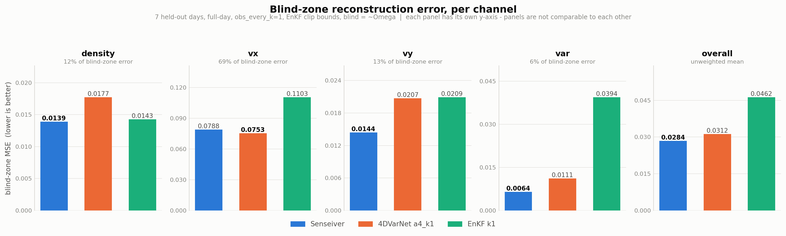

# senseiver_crowd — Senseiver 在 ATC 人群场上的复现

**第三条方法路线**。前两条（4DVarNet 复现 + Localized EnKF 对比）在
[`../4dvarnet_enkf/`](../4dvarnet_enkf/)。本目录只复用它的**数据管线与观测配置**
（`config.yaml` / `observation_model.py` / `navigation.py`），不依赖它的任何结论，
也不修改它的任何一行。

论文：Santos et al., *The Senseiver: attention-based global field reconstruction from
sparse observations*（NeurIPS ML4PS 2022 workshop；正式版 Nature MI 2023）。
参考实现：[`../../reference/Senseiver/`](../../reference/Senseiver/)（官方 PyTorch 代码）。

**目标是复现论文的方法**，不是先做改进。凡是偏离参考实现的地方都在下面逐条列出并说明理由。

---

## 端到端

```bash
module load scicomp-pytorch-env/2026.1
cd /scratch/work/zhangx29/Thesis_Project/senseiver_crowd

# 1. 自检（GPU 节点，约 1 分钟）
srun -p gpu-debug --gres=gpu:1 -t 00:14:00 --mem=16G bash -c \
  'module load scicomp-pytorch-env/2026.1; python3 -u checks/check_model.py; python3 -u checks/check_sensors.py'

# 2. 训练（自链接到 100 epoch）
sbatch sbatch/submit_train.sbatch
#   -> runs/senseiver_A/{last.pt, best.pt, metrics.jsonl}

# 3. 在 7 个留出日上评估（口径与 4DVarNet / EnKF 完全一致）
sbatch sbatch/submit_eval.sbatch --ckpt runs/senseiver_A/best.pt --tag _test
#   -> check_outputs/eval/senseiver_metrics_test.json
```

**torch 只在 GPU 节点跑**（`sbatch`，或 `srun -p gpu-debug --gres=gpu:1`），不要在登录节点。

---

## 目录结构

| path | 角色 |
|---|---|
| `positional.py` | 论文 `a = PE(χ)`：sin-cos 位置编码 |
| `model.py` | 论文 `z = E(a_s,s)` 与 `ŝ_q = D(z,a_q)`：Encoder / Decoder |
| `sensors.py` | **本项目新增**：观测 → 变长传感器 token 集（padding + pad_mask） |
| `network.py` | 整机（纯 PyTorch，不用 Lightning） |
| `losses.py` | 训练损失（照抄参考实现的无权重 MSE）+ 诊断拆分 |
| `dataset.py` | 一天 → 样本；观测配置逐字读 `4dvarnet_enkf/config.yaml` |
| `train.py` | 训练循环（Adam / AMP / `--resume`） |
| `checks/check_model.py` | 置换不变性、padding 不变性、可微、维度断言 |
| `checks/check_sensors.py` | token 构造的不变量 |
| `checks/trace_pipeline.py` | 打印数据管线每一步的形状；README 的 Pipeline 一节就是它的输出 |
| `checks/evaluate.py` | 留出日评估，指标逐字复刻 `eval_test_days.py` |
| `checks/compare3.py` | 三方逐通道对比（Senseiver / 4DVarNet / EnKF），全天同口径 |
| `checks/plot_compare3.py` | 上者的图（小多组，每通道一个面板） |
| `sbatch/` | SLURM 提交脚本（训练自链接续训） |
| `runs/` `check_outputs/` | 产物 |

---

## 方法：Senseiver 的三个组件在代码里的落点

论文 §2：

```
a    = PE(χ)                    positional.PositionalEncoder
z    = E(PE(χ_s), s(χ_s,t))     model.Encoder      传感器集 -> 定长 latent
ŝ_q  = D(z, PE(χ_q))            model.Decoder      latent + 查询坐标 -> 场值
```

Appendix A 的结构细节，参考实现的具体做法：编码块 = cross-attention（可学习 latent 当 Q，
传感器当 K/V）+ self-attention 块，`num_layers` 个块**共享权重**（`layer_1` 独立 +
`layer_n` 复用 `num_layers-1` 次）。解码 = 查询位置编码与一个可学习向量拼接当 Q，
z 当 K/V，单层 cross-attention 后接线性输出头（`latent_size=1`）。

### 为什么选这个方法（论述要点）

**不是因为可扩展性。** 论文的卖点是解码代价与域大小解耦，能吃下 128×128×512 的域；
ATC 只有 36×12 = 432 格，这个卖点在这里完全用不上，稠密 CNN 反而更省。

**是因为传感器集是变长、移动、无序的。** 三个机器人每秒看到的格子集合和数量都在变
（实测 k=1 下 **每帧 185–265 格**）。cross-attention 对这样的集合天然置换不变、长度无关，
而 Voronoi-CNN / 稠密卷积那一类方法处理"传感器位置每帧都变"是别扭的。
`checks/check_model.py` 把置换不变性和 padding 不变性证明成了可复跑的断言
（实测 max|Δ| 分别为 2.7e-7 和 0.0），这是本方法能站住的前提。

---

## Pipeline：一帧数据从原始网格走到损失

下面每个形状都是 `checks/trace_pipeline.py` 真跑出来的，不是推的。

```
① grid_cache 一天                      (T, 4, 36, 12)   float32
   4dvarnet_enkf 的 Stage-2 产物，1 秒 1 帧
        │
        │  observation_model.generate_observations   ← 4dvarnet_enkf，配置读 config.yaml
        ▼
② Y      (T, 4, 36, 12)   带噪部分观测，未观测处 = 0
   Omega  (T, 36, 12) bool 该秒哪些格被机器人看到（逐帧变化；追踪的这 64 帧里 105–265，
                                                  整天平均 202.8）
        │
        │  dataset.load_day   展平 H×W → HW，并按 --stride 抽帧
        ▼
③ X  (N, 4, 432)   目标（真值）
   Y  (N, 4, 432)   观测
   Om (N, 432) bool
        │
        │  sensors.build_batch   ← 本项目新增的那一步
        ▼
④ tokens   (B, Nmax, 68)   Nmax = 批内最大传感器数；68 = 4 通道值 + 64 位置编码
   pad_mask (B, Nmax) bool  True = padding 位
        │
        │  model.Encoder   cross-attn(latent 当 Q, 传感器当 K/V) + self-attn，权重共享 3 层
        ▼
⑤ z  (B, 64, 32)   ← 定长！与传感器数量无关，这是 Senseiver 的全部要点
        │
        │  model.Decoder   查询坐标当 Q，z 当 K/V
        │  coords (B, 432, 64)  ← 整张网格的位置编码，每帧都查全部 432 格
        ▼
⑥ out (B, 432, 4)  →  reshape  →  (B, 4, 36, 12)
        │
        │  losses.senseiver_loss = 原始场上的四通道无权重 MSE（照抄参考实现）
        ▼
⑦ 与 X 比。盲区 = ~Omega 广播到 4 通道（实测约占 42%）
```

### 四个关键点

**为什么 ④→⑤ 是这个方法的全部价值。** 每帧传感器数从 224 变到 265，但 z 永远是
`(64, 32)`。变长、无序的观测集合被压成定长表示——`checks/check_model.py` 把这一点
证明成了断言（打乱顺序 max\|Δ\| = 2.7e-7，padding 到不同长度 max\|Δ\| = 0.0）。

**⑥ 查询的是全部 432 格，不是 290 个 walkable 格。** 理由见"偏离"第 1 条：机器人
能看见它开不进去的格子（实测 32.1%），而且评估口径给非 walkable 格打分。

**标准化只在 ④ 发生。** tokens 的前 4 维是 `(Y - mean) / std`，但 ⑥ 的输出和 ⑦ 的
损失都在**原始场**上。输入侧标准化是特征调理；对目标做逐通道缩放则等价于给损失加权重，
那会改变被优化的量。

**四个通道是一起训的，损失被 vx 主导。** 四通道无权重相加（论文 Eq.，我们照抄），
而 vx 的 std 是 0.54、var 只有 0.12，所以单一 MSE 里 vx 占大头。这不是 bug，是这个
指标的性质——`4dvarnet_enkf/checks/compare_channels.py` 的文件头抱怨的是同一件事。
**报告时单一数字和逐通道拆分必须都给**（`evaluate.py` 两个都写进 JSON 了）。

### 容易看错的两个 "1"

| 名字 | 是什么 | **不是**什么 |
|---|---|---|
| `latent_size = 1` | 解码器里可学习标记向量的个数，拼在每个查询点的位置编码后面当 Q。参考实现 `s_parser.py` 硬编码为 1，注释 "collapse from n_sensors to 1 observation" | 不是输出通道数。改成 2 只会让每个查询点变成两行 Query |
| `dec_num_cross_attention_heads = 1` | 解码器 cross-attention 的注意力头数 | 同样与通道数无关 |

**输出通道数由 `im_ch` 决定，取自 `config.yaml` 的 `state_shape: [4,36,12]`，恒为 4。**
可以从 checkpoint 直接核对：`decoder.postproc.weight` 的形状是 `(4, 32)`，
`encoder.preproc.weight` 是 `(32, 68)`，`in_mean` 有 4 个元素。

---

## 偏离参考实现之处（逐条，附理由）

**必改（照抄会出错）**

1. **取消 `pix_avail`（"值为 0 即无效"），查询全部 432 格。**
   参考实现用 `data[0]!=0` 挑参与训练的像素（`dataloaders.py:152`），并在测试时
   `output_im[data==0]=0`（`network_light.py:126`）。这个 hack 的用途是跳过
   **没有值可重建**的区域（海温的大陆、孔隙的固体）。ATC 网格上不存在这样的格子：
   密度 0 是合法值，非 walkable 区同样有真值，而且**评估口径会给它们打分**。
   `check_sensors.py` 实测 **32.1% 的观测格落在非 walkable 区**（机器人能看见开不进去的
   柱子，见 4dvarnet_enkf README），进一步说明不能按 walkable 裁剪查询集。
2. **`Decoder` 增加维度断言。** 解码器的 cross-attention 把 `dec_num_latent_channels`
   当 KV 维，而喂进去的 `z` 的通道数由**编码器**决定；两者不等会静默错位。参考实现
   没有这个检查，它 README 的例子恰好都设成相同值，掩盖了这个坑。

**必加（参考实现没这个场景）**

3. **变长传感器集：padding + `pad_mask`。** 这条通路在参考实现里其实**已经存在**
   （`Encoder.forward(x, pad_mask)` → `CrossAttention` → `key_padding_mask`），只是它的
   dataloader 从不传值，因为它的传感器集定长。我们没有改结构，只是第一次把它用上。
4. **空传感器集的保护。** `obs_every_k > 1` 时有的帧一个观测都没有，cross-attention 的
   K/V 为空会让 softmax 产生 NaN。放一个全零哑 token 并标为有效；模型对这种帧只能输出
   常数场——这是信息上的事实，不是实现缺陷。
5. **逐通道输入标准化。** 参考实现的 5 个数据集**全是单通道**（`datasets.py` 里
   `sea`/`pipe`/`cylinder`/`plume`/`pore` 最后一维都是 1），所以它只做了一个全局标量
   除法，对多通道没有给出做法。我们有 4 个尺度差一个量级以上的通道。做法：
   **只标准化编码器输入，目标与损失一律留在原始场**。理由：对比口径是原始场上的
   四通道无权重 MSE，任何对目标的逐通道缩放都等价于偷偷给损失加权重。

**工程性**

6. **删掉 `fairscale` 的 `checkpoint_wrapper`。** `activation_checkpoint` 在参考实现里
   从未被 `s_parser.py` 暴露，恒为 False，是死代码。
7. **不用 PyTorch-Lightning。** 参考实现的 `train.py` 的 `Trainer()` **没传
   `accelerator`/`devices`**，`s_parser.py` 算出来的 `gpu_device` 只在 `--test` 分支用得上，
   所以命令行指定卡号在训练时是无效的。我们要在 SLURM 上自链接续训，自己写循环更省事。
8. **`space_bands` 32 → 16。** 频率是 `linspace(1, dim/2, bands)`，W=12 时最高频只有 6，
   32 个 band 纯冗余。
9. **`lr` 默认 1e-3**（参考的 argparse 默认是 1e-4）。它 README 里帧数上万的那个例子
   （pipe）用的就是 1e-3，我们是百万帧量级，同一档。
10. **不做像素抽样。** 参考实现每步只随机查 `batch_pixels` 个像素，因为它的域大到无法
    整张查。432 格整张查一次的代价可以忽略，去掉一个与论文无关的随机性来源。
11. **`--stride` 抽帧。** 相邻秒高度冗余。这不算改动——参考实现同样是从全部帧里随机抽
    `training_frames` 帧来训练。

**明确没有搬过来的**

12. **参考实现的传感器数量增广。** `dataloaders.py:168-171` 只对 `pipe` 数据集做了
    "每批从 6144 个传感器里随机取 `40+300|N(0,1)|` 个"——论文 Fig.2b 那条"推理时任意
    传感器数都能用"的曲线就是靠它训出来的，而它的 README 完全没提。我们不需要：
    移动机器人**天然**每帧数量都不同，这个增广是内建的。

---

## 与另两种方法的公平契约

三种方法面对的观测**完全一致**，差异只来自方法本身：

| 锚点 | 做法 |
|---|---|
| 观测参数 | 逐字读 `4dvarnet_enkf/config.yaml` 的 `observation` 段；本目录不设任何默认值 |
| 观测生成 | 直接调用 `om.generate_observations` + `nav.build_valid_mask_from_config` |
| 数据切分 | `om.split_files()`；32 训练日 / 7 验证日 / 7 测试日，训练日严格早于测试日 |
| 指标 | 盲区 MSE（`mask<0.5`）+ 全场 MSE，原始场、四通道无权重、含非 walkable 格 |
| 物理裁剪 | 与 EnKF 相同：density[0,5]、vx/vy[-5,5]、var[0,2]（默认开） |
| 初值 | 均不从真值初始化 |
| 计时 | 只计模型前向，不计数据准备（三种方法共享的常数） |

对标线（全天口径，盲区 MSE）：**4DVarNet 0.0338**，**EnKF 0.0392**。

### 一句必须写进结论的话

本版 Senseiver **只看第 t 帧的观测重建第 t 帧**（论文原样，无任何时间编码——论文
§3 Discussion 明说 sin-cos 时间编码试过且失败了）。而 4DVarNet 看的是 dT=200 帧的
时窗。这**不是公平比较，是有意的消融**：它量化的正是"时间维度值多少"。不加这句话，
表格会被误读。

---

## 结果（7 个留出日，全天，obs_every_k=1，三方同一裁剪）

由 `checks/evaluate.py`（单方）和 `checks/compare3.py`（三方逐通道）产生。
4DVarNet 的数字是**我们用它自己的 `eval_test_days.py` 重跑的**（`--outdir` 指向本目录，
不写入 4dvarnet_enkf），与它存档值吻合到小数点后 4 位，确认存档口径同样是 clip ON。

### 总表

| 方法 | 盲区 MSE | 全场 MSE | 参数量 | ms/帧 |
|---|---|---|---|---|
| **Senseiver** | **0.0284 ± 0.0034** | **0.0171** | **65,892** | **0.047** |
| 4DVarNet `a4_k1` | 0.0308 ± 0.0036 | 0.0272 | 2,096,432 | 0.184 |
| 4DVarNet `b0_k1` | 0.0338 ± 0.0040 | 0.0290 | 2,051,596 | 0.086 |
| EnKF `k1` | 0.0462 | — | — | — |

Senseiver 逐日 7/7 胜 4DVarNet-a4，差值 mean +0.00237、std 0.00030（远小于差值本身）。

> **口径警告**：`4dvarnet_enkf/check_outputs/eval/enkf_metrics.json` 里的 **0.0392
> 不能用**——它来自 `check_outputs/enkf/`，是 **obs_every_k=4 且每天只有 400 帧**。
> 而每天前 400 帧是空场（密度只有全天的 1/6.9），双重偏易。全天 k=1 的 EnKF 估计在
> `check_outputs/enkf_k1_full/`，重新打分是 **0.0462**。

### 逐通道盲区 MSE —— 排名**不是**一致的

| 方法 | density | vx | vy | var | 合计 |
|---|---|---|---|---|---|
| Senseiver | **0.0139** | 0.0788 | **0.0144** | **0.0064** | **0.0284** |
| 4DVarNet `a4_k1` | 0.0177 | **0.0753** | 0.0207 | 0.0111 | 0.0312 |
| EnKF `k1` | 0.0143 | 0.1103 | 0.0209 | 0.0394 | 0.0462 |



图用**小多组**而不是分组柱状图：四个通道量级差一个数量级，同一根 y 轴会把
density/vy/var 压成看不见的细条，读者只剩下 vx 的差异可看——而那恰好是唯一
4DVarNet 领先的通道，图会给出与数据相反的印象。各面板 y 轴独立，面板之间不可比。

**必须和总表一起报的三件事：**

1. **vx 上 4DVarNet 赢**（0.0753 vs 0.0788，好 4.4%），而 vx 占盲区总误差的 **69%**。
   Senseiver 的总分领先**全部来自另外三个通道**（density −21%、vy −30%、var −42%）。
   即：在走廊主方向的人流速度上，变分同化的动力学先验仍然更强。
2. **EnKF 在 density 上几乎追平**（0.0143 vs 0.0139），尽管总分落后 46%——它是被 var
   拖垮的（0.0394，是 Senseiver 的 6 倍）。总分最差的方法在最有物理意义的通道上是竞争性的。
3. 只报合计会给出"Senseiver 全面胜出"的错误印象。**逐通道必须一起给。**

### 误差的区域分解

盲区占 53.1%（逐日几乎不变）。把全场 MSE 拆成盲区 / 观测区：

| 方法 | 盲区 | **观测区** | 全场 |
|---|---|---|---|
| Senseiver | 0.0284 | **0.0043** | 0.0171 |
| 4DVarNet `a4_k1` | 0.0308 | **0.0231** | 0.0272 |
| 相对优势 | **+7.7%** | **+81.4%** | +37% |

**全场那个 37% 主要来自观测区，不是来自对未观测区域猜得更准。** 解码器可以让每个查询点
直接 attend 到该位置的传感器 token，所以观测格上基本是在复现观测值（误差 0.0043，
量级接近观测噪声本身）；4DVarNet 的解在 20 步学习式梯度下降里被先验项拉着走，
观测区会被平滑掉一部分。

两个数都不是作弊——两种方法拿到同一份观测，还原观测处本来就是任务的一部分。但
**用全场 MSE 当头条会显著夸大结论**；4dvarnet_enkf 的 README 把盲区 MSE 标为
*the real task* 是有道理的。

### 消融：观测到底贡献了多少

抹掉传感器**读数**、只保留它们的**位置**与 pad_mask（`checks/evaluate.py --ablate-values`）：

| | 盲区 MSE | 全场 MSE |
|---|---|---|
| 正常 | 0.0284 | 0.0171 |
| 只给位置 | 0.0343 (**+21%**) | 0.0515 (+201%) |

模型确实在用观测，但**盲区重建里有相当大一部分来自学到的走廊气候态，而不是当下的观测**。
而且 21% 是**上界**——抹掉读数喂的是模型没见过的常数（分布外输入），一个专门训练的
纯气候态模型只会更好。

所以正确的表述是：**在这个覆盖率(47%)和这个稀疏度下，一个直接的、摊销式的回归器比
迭代变分同化更有效**，而不是"注意力机制把稀疏观测用得特别好"。

### 一个有利于本方法的设定差异

Senseiver 只用第 t 帧的观测重建第 t 帧；4DVarNet 重建第 t 帧时可以用整个 dT=200 窗口的
观测。**4DVarNet 拿到的信息严格更多**，这个设定对 Senseiver 不利，而它在总分上仍然领先。
这让总分结论更强，但不改变上面第 1 条（vx 上它是输的）。

---

## 实测的数据事实

| 量 | 值 |
|---|---|
| 网格 | 36×12 = 432 格，4 通道；walkable 290 格 |
| 观测覆盖（k=1） | 每帧 185–265 格，约 44–47% |
| 观测格落在非 walkable | 32.1% |
| 通道量级（walkable 内，std） | density 0.17 / vx 0.46 / vy 0.16 / var 0.11 |
| 帧数 | 约 40k 帧/天 × 32 训练日 ≈ 128 万帧 |
| 模型参数量 | 65,892（默认超参） |
| 数据准备 | 10.3 s/天（整天观测模拟），144 MB/天（stride=4） |

覆盖率 44% 意味着**这不是 Senseiver 论文的稀疏区**（NOAA 是 10~300 传感器 / 64800 格，
< 1%）。报告里不要引用它的稀疏性卖点。

---

## Gotchas

- **`sys.path` 用 `append` 不是 `insert(0)`**：`4dvarnet_enkf` 里也有 `losses.py`，
  插到最前会把本目录的同名模块顶掉。
- **`/tmp` 是节点本地的**：计算节点写进 `/tmp` 的东西登录节点看不见。产物一律写
  `runs/` 和 `check_outputs/`。
- **前 400 帧是空场**：`--frames 400` 的评估数字会明显偏乐观，只适合冒烟，不要当结论。
- **EnKF 的 0.0392 不能引用**：`4dvarnet_enkf/check_outputs/eval/enkf_metrics.json`
  来自 `check_outputs/enkf/`，是 obs_every_k=**4** 且每天只有 **400** 帧的双重偏易子集。
  全天 k=1 的估计在 `check_outputs/enkf_k1_full/`，重新打分是 **0.0462**。
  同理 `test_metrics_matched_clip.json` 的 0.0258 也是 400 帧口径。
- **单日结论不能外推**：逐通道排名在单日和七天上会不同（我们踩过：单日看 EnKF 的
  density 最好，七天下来是 Senseiver 略优）。任何逐通道声明都要用满 7 天。
- `observation_model.generate_observations` 的 docstring 说 "only observe walkable cells"，
  与该项目 README 和实际数据不符（实测 32.1% 越界）。以数据为准。
